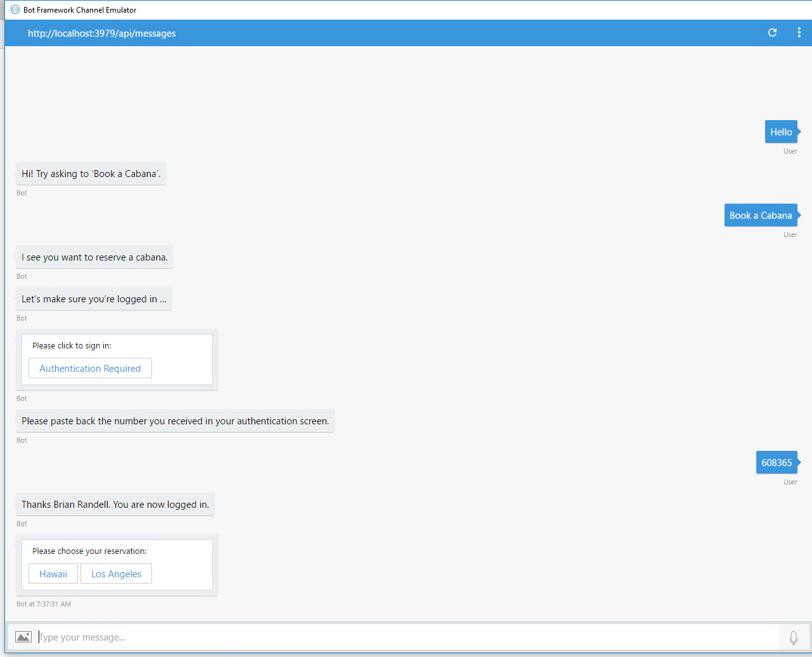
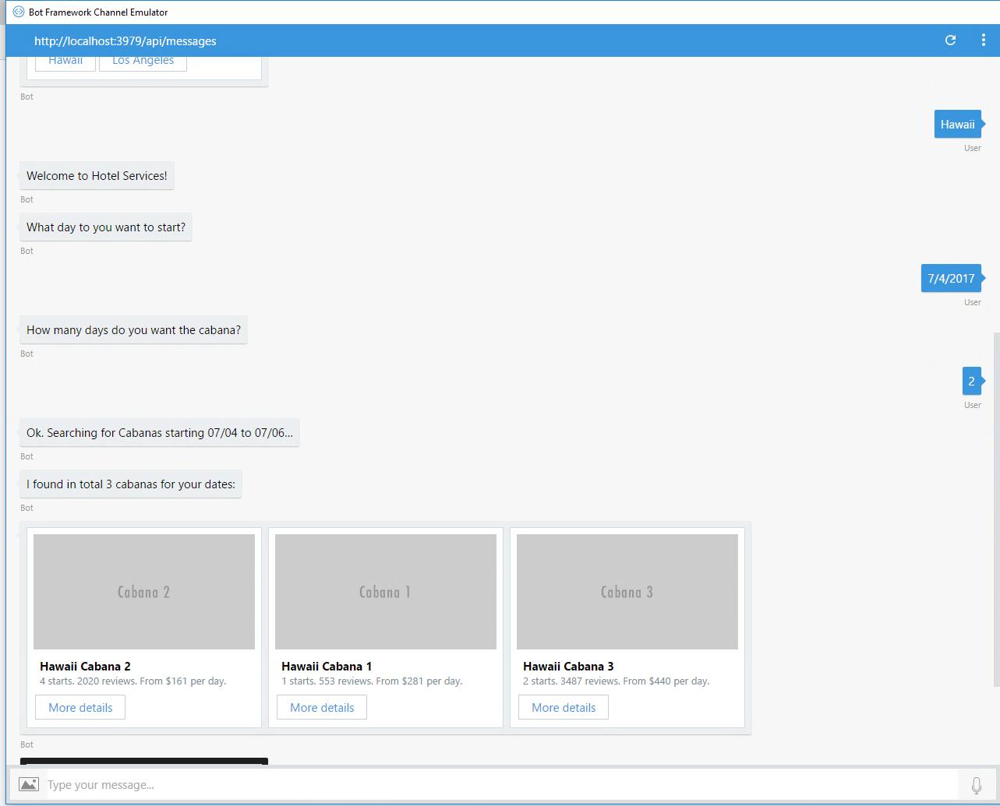
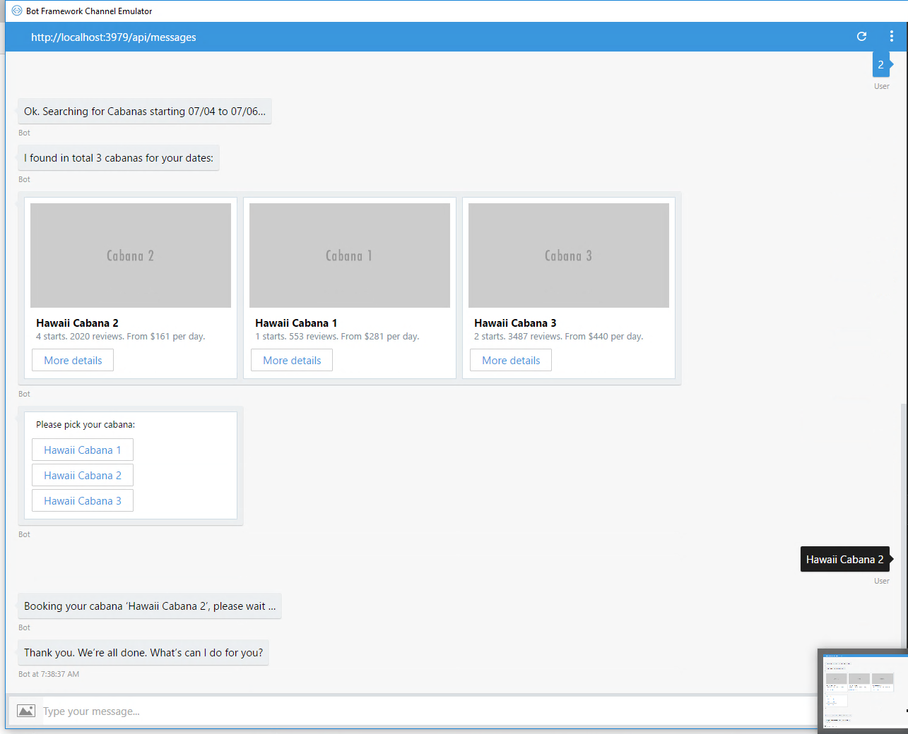

# Commerce Bot Sample
The Commerce Bot replaces traditional interactions with a hotel's concierge service with an easy to use bot that validates the customer and uses Cognitive Services to better process customer requests using LUIS.

## Scenario
In the Commerce Bot scenario, a customer, authenticated via a Azure Active Directory v2 authentication endpoint can make a request for concierge services with a hotel. The bot will be able to look up the customer's reservations and provides different service options. In this example, the customer might book a cabana by the pool. The bot integrates with the Language Understanding Intelligent Services (LUIS) Service to parse the request and then the bot walks the user through the process of booking a cabana for an existing reservation.

## Prerequisites
The minimum prerequisites to run this sample are:
-   The latest update of Visual Studio 2017. You can download the community version [here](https://www.visualstudio.com/downloads/) for free.
-   The Bot Framework Emulator. To install the Bot Framework Emulator, download it from [here](https://emulator.botframework.com/). Please refer to this [documentation article](https://github.com/microsoft/botframework-emulator/wiki/Getting-Started) to know more about the Bot Framework Emulator.
-   A defined Converged App for Authentication separate from your Bot at [https://apps.dev.microsoft.com/#/appList](https://apps.dev.microsoft.com/#/appList). You will need the User.Read permission.
-   A Configured LUIS Application configured at the [LUIS website](https://luis.ai). You'll find **CommerceBotLUIS.json** that you can import into LUIS for the sample.
-   In order to test locally, you'll need the Azure workload installed with Visual Studio. The bot has been configured to use Azure Table Storage and works with the emulator when running locally. If you plan to deploy the bot, you'll need to provision an Azure Storage Account. You can find more details at [Manage custom state data with Azure Table Storage for .NET](https://docs.microsoft.com/en-us/azure/bot-service/dotnet/bot-builder-dotnet-state-azure-table-storage).

## Setup instructions
In order to work with this bot, you'll need to do the following:
-   Create a Converged App for Authentication and to access Office 356
-   Import the **ApplicaitonBotLUIS.json** file to LUIS

### Create a Converged App
By using the Azure Active Directory v2 authentication endpoint, you can make it easy for your users to authenticate with your bot. Depending upon the services you expose, you can support both Azure AD backed work, or school accounts (also known as Org Ids), or  Microsoft Accounts (aka MSAs) from a single application configuration. When you publish your bot for use in production, you create a converged application. The one you're going to create here is to validate the user and get their e-mail address which could then be correlated to the hotel's back-end. Thus if you were to publish your bot, you'd have two converged apps: one for the bot itself and one for accessing the user's calendar.

#### Create your converged app
First you'll create your converged app **Application Registration Portal**.

1.  Navigate to [https://apps.dev.microsoft.com/#/appList](https://apps.dev.microsoft.com/#/appList) and login.

1.  Click the **Add an app** button to the right of *Converged applications*.

1.  Provide a name for your app and verify the contact e-mail address.

1.  Click the **Create button**.

1.  On the next page, copy the **Application Id** so you can use it shortly.

1.  Click **Generate New Password** and **save that value** out somewhere safe. You'll need it later.
  
1.  Click the **Add Platform** button.

1.  In the popup, click **Web**.

1. In the *Redirect URLs* text field, enter **http://localhost:3979/Callback**. This URL will be used for testing in the emulator. For production use, you would need to add a proper URL pointing to your deployed instance.

1.  The default User.Read permission is already present so you only need to scroll down to the bottom and click **Save**.

#### Update your App
Now you'll update your app with the Application Id and secret you created in the **Application Registration Portal**.

1.  Open the **Web.config** file.

1.  Add the following three elements to the **configuration appsettings** section:

    ````XML
    <add key="aad:ClientId" value="--replace with your Application Id" />
    <add key="aad:ClientSecret" value="Replace with your Password" />
    <add key="aad:Callback" value="http://localhost:3979/Callback" />
    ````
1.  Save your changes.

### Configure LUIS
If you want to test this sample, you have to import the prebuilt **CommerceBotLUIS.json** file to your LUIS account.

The first step to using LUIS is to create or import an application. Go to the home page, [www.luis.ai](www.luis.ai), and log in. After creating your LUIS account, you'll be able to *Import new app* where can you can select a local copy of the CommerceBotLUIS.json file and import it.


Once you have imported the application, you'll need to "train" the model [Training](https://docs.microsoft.com/en-us/azure/cognitive-services/luis/train-test) before you can "Publish" the model in an HTTP endpoint. For more information, take a look at [Publishing a Model](https://docs.microsoft.com/en-us/azure/cognitive-services/luis/publishapp).

You will need to gather two pieces of data from your LUIS app:
-   Application ID 
-   Subscription Key

#### Where to find the Application ID and Subscription Key

You'll need these two values to configure the LuisDialog through the LuisModel attribute:

-   Application ID

    In the LUIS application's dashboard, you can copy the App ID from the address bar.

    

-   Subscription Key (Key String)

    In the **Publish** section of the LUIS dashboard, under the *Resources and Keys* section, copy the **Key String**.

    

#### Update your App
Once you've configured the LUIS model, you will need to add the Application ID and Subscription Key to the source of the bot.

1.  Open the **AppRootDialog.cs**. 

1.  At the top of the AppRootDialog class, you'll find a **LuisModel** attribute.

1.  Replace the empty parameters with your values:

    ````C#
    [LuisModel("Application ID", "Subscription Key")]
    ````

1.  Save and build your bot.

## Code Highlights
The Commerce Bot's flow starts with letting the user preform a request parsing that request with LUIS. Because the bot's main purpose is to work with hotel's back-end to book cabanas, etc., once the request has been parsed, the user must be authenticated. Following authentication, the actual process of looking at the user's reservations and booking a cabana can take place.

### Using LUIS
Working with LUIS takes two steps. First you need to define your model at the LUIS site. We've provided a simple sample model that handles the one key command phrase for the app--booking a cabana. It could be enhanced of course to handle more requests. You've already bound the model to your bot by adding the LuisModel attribute to the **AppRootDialog.cs** file. If you open that file you'll see can see how LUIS works with the user's input.

Processing requests is done via an async method that return Task objects. In this example, the LUIS model is very simple only handling one intent: Reserve.Cabana. The **ReserveCabana** method checks to see if LUIS thinks the user wants to book a cabana. If the entity returned is of the Cabana type and LUIS is more then 50% confident the user is asking about an cabana, then it forward the request on to the **AppAuthDialog** class to authenticate the user. If the confidence is below that, the bot tells the user it doesn't understand.

````C#
[LuisIntent("Reserve.Cabana")]
public async Task ReserveCabana(IDialogContext context,
                         IAwaitable<IMessageActivity> activity,
                         LuisResult result)
{
    Trace.TraceInformation("AppRootDialog::ReserveCabana");

    var message = await activity;
    IAwaitable<object> awaitableMessage = await activity as IAwaitable<object>;

    if (!result.TryFindEntity(EntityCabana, out EntityRecommendation cabanaRec)
        || cabanaRec.Score <= .5)
    {
        Trace.TraceWarning("Low Confidence in ReserveCabana.");

        await context.PostAsync($"I'm sorry, I don't understand '{message.Text}'.");
        context.Wait(this.MessageReceived);
        return;
    }

    await context.PostAsync("I see you want to book a cabana.");

    await context.Forward(new AppAuthDialog(),
        this.ResumeAfterHotelServicesDialog, message, CancellationToken.None);
}
````

### User Authenticaiton
Before a cabana booking can be created, the bot needs to make sure the user is authenticated. This will allow the bot to lookup the user's reservations in the hotel's backend. This is handled in the **AppAuthDialog** class. This class works with the **BotAuth.AADv2** library by Richard diZerega from Microsoft.

The **MessageReceivedAsync** method loads the information related to your converged app from the *Web.config* file and then forward the request to the BotAuth library to complete the authentication flow. 

````C#
private async Task MessageReceivedAsync(
    IDialogContext context,
    IAwaitable<object> awaitableMessage)
{
    SD.Trace.TraceInformation("AppAuthDialog::MessageReceivedAsync");

    var activity = await awaitableMessage as Activity;
    await context.PostAsync("Let's make sure you're logged in ...");

    // Initialize AuthenticationOptions and forward to AuthDialog for token
    AuthenticationOptions options = new AuthenticationOptions()
    {
        ClientId = ConfigurationManager.AppSettings["aad:ClientId"],
        ClientSecret = ConfigurationManager.AppSettings["aad:ClientSecret"],
        Scopes = new string[] { "User.Read" },
        RedirectUrl = ConfigurationManager.AppSettings["aad:Callback"]
    };

    context.ConversationData.SetValue("Activity", activity);
    await context.Forward(
        new BotAuth.Dialogs.AuthDialog(new MSALAuthProvider(), options),
        this.AfterInitialAuthDialog,
        activity,
        CancellationToken.None);
}
````

Assuming the user authenticates and the first time grants permission to the app to read the user's name and e-mail, then the flow returns to the **AfterInitialAuthDialog** method. This method first ensures that a valid token is still avaialble to the bot. Naturally the first time the user logs in, this will be the case. However, the user could walk away from the conversation and then come back and want to continue so the bot needs to handle that.

````C#
private async Task AfterInitialAuthDialog(
    IDialogContext authContext,
    IAwaitable<AuthResult> awaitableAuthResult)
{
    try
    {
        SD.Trace.TraceInformation("AppAuthDialog::AfterInitialAuthDialog");

        AuthResult authResult = await awaitableAuthResult;
        Activity activity = authContext.ConversationData.GetValue<Activity>("Activity");

        // return our reply to the user for debugging purposes
        if (displayAuthMessages)
        {
            int length = (activity.Text ?? string.Empty).Length;
            await authContext.PostAsync($"We see you sent {activity.Text} which was {length} characters");
        }

        if (authResult == null)
        {
            await authContext.PostAsync("You didn't log in.");
            authContext.Done(true);
            return;
        }
        else
        {
            if (displayAuthMessages)
            {
                await authContext.PostAsync($"Token: {authResult.AccessToken}");
            }
        }

        // Use token to call into service
        JObject json = await new HttpClient().GetWithAuthAsync(
            authResult.AccessToken, GraphUrl);

        // Two items to test
        // A -- Access Token Expires, do JUST [Part 1] Below
        // B -- Access Token Expires AND refresh fails, do [Part 1], [Part 2], and [Part 3].
        //
        // To test auth expiration null out json variable (uncomment next line) [Part 1]
        // json = null;
        if (json == null)
        {
            var authProvider = new MSALAuthProvider();
            AuthenticationOptions options =
                authContext.UserData.GetValue<AuthenticationOptions>(
                    $"{authProvider.Name}{ContextConstants.AuthOptions}");

            SD.Trace.TraceInformation("Attempting to refresh with token.");
            if (displayAuthMessages)
            {
                await authContext.PostAsync($"Attempting to refresh with token: {authResult.RefreshToken}");
            }

            // To test auth expiration comment out next line [Part 2]
            authResult = await authProvider.GetAccessToken(options, authContext);

            // To test auth expiration uncomment out next two lines [Part 3]
            // authResult = null;
            // await authProvider.Logout(options, authContext);
            if (authResult != null)
            {
                SD.Trace.TraceInformation("Token Refresh Succeeded.");
                if (displayAuthMessages)
                {
                    await authContext.PostAsync($"Token Refresh Succeeded. New Token: {authResult.AccessToken}");
                }
                json = await new HttpClient().GetWithAuthAsync(
                    authResult.AccessToken, "https://graph.microsoft.com/v1.0/me");
            }
            else
            {
                SD.Trace.TraceInformation("Token Refresh Failed. Trying full login.");

                if (displayAuthMessages)
                {
                    await authContext.PostAsync("Token Refresh Failed. Trying full login.");
                }
                await authContext.Forward(
                                new BotAuth.Dialogs.AuthDialog(new MSALAuthProvider(), options),
                                this.AfterInitialAuthDialog,
                                activity,
                                CancellationToken.None);
                return;
            }
        }
        
        // End Part 1
}

````
Once the bot is sure the user is still autenticated, it can hand off back to the application logic portion of the bot. Data about the authenticated user is added to a **UserProfile** instance that and stored in ConversationData object of the context. The code then hands off to the **CabanaReservationDialog** to continue working with the user on booking their cabana.

````C#
private async Task AfterInitialAuthDialog(
    IDialogContext authContext,
    IAwaitable<AuthResult> awaitableAuthResult)
{
        // Part 2
        
        SD.Trace.TraceInformation("Getting user data post auth.");
        string userName = json.Value<string>("displayName");
        string userEmail = json.Value<string>("userPrincipalName");

        if (displayAuthMessages)
        {
            await authContext.PostAsync($"I now know your name is {userName} " +
                $"and your UPN is {userEmail}");
        }

        ICabanaReservationOperations icro = ServiceLocator.GetCabanaReservationOperations();
        UserProfile userInfo = await icro.GetUserInformation(userName, userEmail);
        authContext.ConversationData.SetValue<UserProfile>(UserSessionDataKey, userInfo);
        authContext.Call(new CabanaReservationDialog(), this.ResumeAfterCabanaReservationDialog);

    }
    catch (Exception ex)
    {
        string fullError = ex.ToString();
        SD.Trace.TraceError(fullError);
        await authContext.PostAsync(fullError);
    }
}
````

### Booking the Cabana
Because this is a sample, there's no real hotel reservation system with which to work. Thus, the sample uses some mocked up class to represent things. You'll find the types in the **Services** folder. Once the bot knows that the user wants to book a cabanan and they have been authenicated, it can start the full process. The **StartAsync** method in **CabanaReservationDialog** class. This method queires the mock hotel system for the users current reservations and shows them to the users via call to **PromptDialog** so they can choose which reservation they want to add a cabana.

````C#
public async Task StartAsync(IDialogContext context)
{
    Trace.TraceInformation("CabanaReservationDialog::StartAsync");

    await context.PostAsync("Welcome to Hotel Services!");

    UserProfile userInfo = context.ConversationData.GetValue<UserProfile>(UserSessionDataKey);
    IHotelReservationOperations ihro = ServiceLocator.GetHotelReservationOperations();
    IList<string> menuOptions = await ihro.GetExistingReservations(userInfo.Id);

    PromptDialog.Choice(context, OnOptionSelected, menuOptions,
            "Please choose your reservation:",
            "Not a valid option", 2);
}
````

Once an option has been picked, a short conversation occurs using a **FormDialog** which asks what day the user wants their cabanan and for how many days. With this data in hand, the "system" can query the backend and present a set of choices with rich information to the user using **HeroCard** objects. Then a **PromptDialog** is used to ask the user to choose one of three cabanan choices. This is done in **ResumeAfterCabanaFormDialog**.

````C#
private async Task ResumeAfterCabanaFormDialog(IDialogContext context, IAwaitable<CabanaQuery> result)
{
    try
    {
        CabanaQuery searchQuery = await result;
        context.ConversationData.SetValue("CabanaQuery", searchQuery);

        await context.PostAsync($"Ok. Searching for Cabanas starting {searchQuery.Start.ToString("MM/dd")} " +
            $"to {searchQuery.Start.AddDays(searchQuery.Days).ToString("MM/dd")}...");

        ICabanaReservationOperations icro = ServiceLocator.GetCabanaReservationOperations();
        IList<Cabana> cabanas = await icro.GetCabanaAvailability(reservationChoice, searchQuery);

        await context.PostAsync($"I found in total {cabanas.Count()} cabanas for your dates:");

        var resultMessage = context.MakeMessage();
        resultMessage.AttachmentLayout = AttachmentLayoutTypes.Carousel;
        resultMessage.Attachments = new List<Attachment>();

        List<string> cabanaChoices = new List<string>();
        foreach (var cabana in cabanas)
        {
            cabanaChoices.Add(cabana.Name);
            HeroCard heroCard = new HeroCard()
            {
                Title = cabana.Name,
                Subtitle = $"{cabana.Rating} stars. {cabana.NumberOfReviews} reviews. From ${cabana.PriceStarting} per day.",
                Images = new List<CardImage>()
                {
                    new CardImage() { Url = cabana.Image }
                },
                Buttons = new List<CardAction>()
                {
                    new CardAction()
                    {
                        Title = "More details",
                        Type = ActionTypes.OpenUrl,
                        Value = $"https://www.bing.com/search?q=hotels+in+" + HttpUtility.UrlEncode(cabana.Location)
                    }
                }
            };

            resultMessage.Attachments.Add(heroCard.ToAttachment());
        }

        await context.PostAsync(resultMessage);
        cabanaChoices.Sort((h1, h2) => h1.CompareTo(h2));

        PromptDialog.Choice(context, this.OnPickCabana, cabanaChoices,
           "Please pick your cabana:",
           "Not a valid option", 3);
    }
    catch (FormCanceledException ex)
    {
        string reply;

        if (ex.InnerException == null)
        {
            reply = "You have canceled the operation. Quitting from the CabanaDialog";
        }
        else
        {
            reply = $"Oops! Something went wrong :( Technical Details: {ex.InnerException.Message}";
        }

        await context.PostAsync(reply);
    }
}
````

Once the user pick's a cabanan, a booking can be made for the user.

````C#
private async Task OnPickCabana(IDialogContext context, IAwaitable<string> result)
{
    string optionSelected = await result;
    string cabanaIdText = optionSelected.Substring(optionSelected.LastIndexOf(' ') + 1);
    int cabanaId = int.Parse(cabanaIdText);

    await context.PostAsync($"Booking your cabana '{optionSelected}', please wait ...");

    CabanaQuery searchQuery = context.ConversationData.GetValue<CabanaQuery>("CabanaQuery");
    int reservationId = 1;

    DateTime startDate = searchQuery.Start;
    int days = searchQuery.Days;

    UserProfile userInfo = context.ConversationData.GetValue<UserProfile>(UserSessionDataKey);
    ICabanaReservationOperations icro = ServiceLocator.GetCabanaReservationOperations();
    CabanaReservation cres = await icro.ReserveCabana(reservationId, cabanaId, startDate, days);

    await context.PostAsync($"Cabana booked. Your Cabana Booking Id is {cres.CabanaBookingId}.");

    context.Done<object>(null);
}
````

### Using Application Insights
The Microsoft Bot Framework and runtime service provides support for gathering runtime telemetry and trends related to the use of your bot via Azure Application Insights.
You configure an Application Insights resource to gather and store data about your application. You can then access your My Bots page to review the information in the Analytics section. To add telemetry to your bot, you will need an Azure subscription and an Application Insights resource created for your bot.

In addition to the base support mentioned above, you can add full Application Insights support to your bot whether it’s been written in C# or Node.js. Doing this allows you to add custom telemetry data via Trace as well as write custom events. Application Insights will also gather additional data related to performance and exceptions that you can drill into from the Azure Portal as well as within Visual Studio if you’re using that to write your Bot.

If you want to use Application Insights in either capacity, you’ll first need to enable Application Insights support by following the instructions at [https://docs.microsoft.com/en-us/bot-framework/resources-app-insights-keys](https://docs.microsoft.com/en-us/bot-framework/resources-app-insights-keys).

Once you’ve done that, you can go to the next level by doing the following:

1.  Open your solution in Visual Studio 2017.

1.  In the Solution Explorer, right click on the **ApplicationBot** project node, and select Configure Application Insights. 

1.  In the document well, click the **Start Free**.

1.  Login in to Azure if necessary, pick your subsription and choose your Application Insights resource.

1.  Follow the wizard enabling Trace options.

1.  Build your bot.

1.  Update NuGet to pick up the latest Applicaiton Insights binaries.

1.  Deploy your updated bot.

1.  You can then access your Applicaiton Insights resource via the Azure Portal.

## Outcome
You will see the following when connecting the Bot to the Emulator and walking through booking a cabana.

### Output







## More Information
To get more information about how to get started in Bot Builder for .NET and Conversations please review the following resources:
-   [Bot Builder for .NET](https://docs.botframework.com/en-us/csharp/builder/sdkreference/index.html)