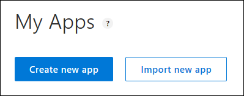
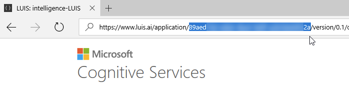
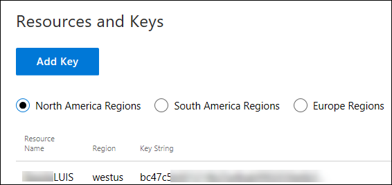
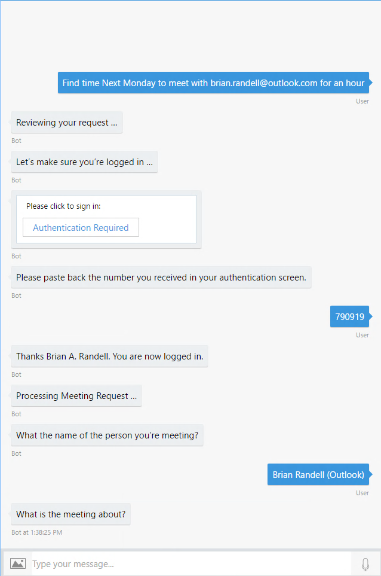
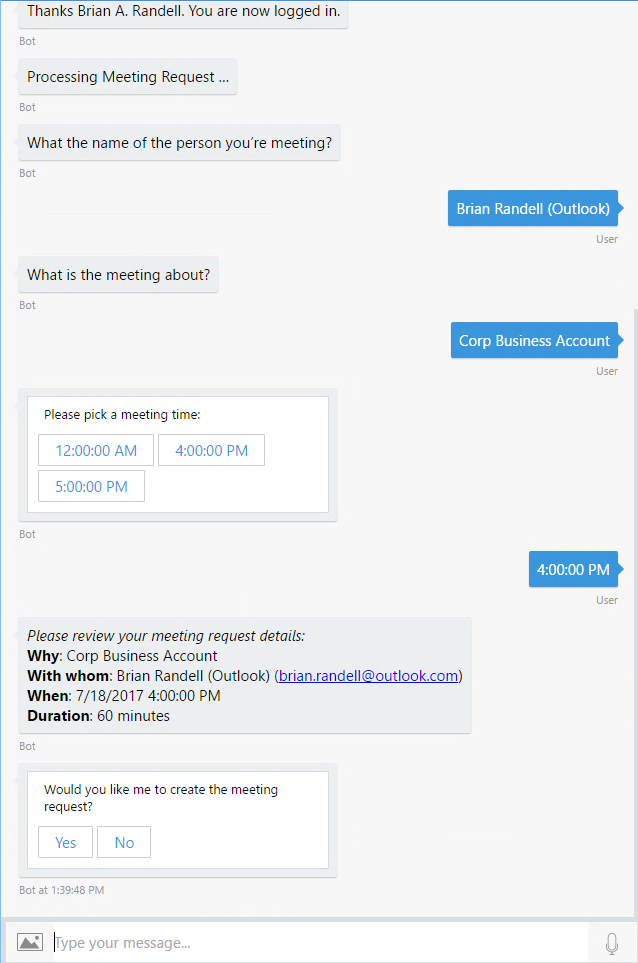
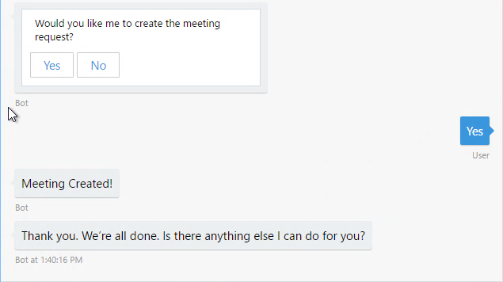

#  Enterprise Productivity Bot Sample
The Enterprise Bot sample shows how you can increase your productivity by integrating a bot with your Office 365 calendar and other services.

## Scenario
This bot integrates with Office 365 to make it quicker and easier to create a meeting request with another person. In the process of doing so you could access additional services like Dynamics CRM. This sample provides the code necessary to integrate with Office 365 with authentication via Azure Active Directory. It provides mock entry points for external services as an exercise for the reader.

## Prerequisites
The minimum prerequisites to run this sample are:
-   The latest update of Visual Studio 2017. You can download the community version [here](https://www.visualstudio.com/downloads/) for free.
-   The Bot Framework Emulator. To install the Bot Framework Emulator, download it from [here](https://emulator.botframework.com/). Please refer to this [documentation article](https://github.com/microsoft/botframework-emulator/wiki/Getting-Started) to know more about the Bot Framework Emulator.
-   A defined Converged App for authentication and to access the user's calendar separate from your bot at [https://apps.dev.microsoft.com/#/appList](https://apps.dev.microsoft.com/#/appList). You will need the User.Read permission for authentication and following Delegated Permissions: Calendars.Read, Calendars.Read.Shared, Calendars.ReadWrite, Calendars.ReadWrite.Shared.
-   A Configured LUIS Application configured at the [LUIS website](https://luis.ai). You'll find an **EnterpriseBotLUIS.json** file that you can import into LUIS for the sample.
-   Access to an Office 365 account to perform testing of the Calendar functions. You'll need an e-mail address of someone to invite to a meeting (they don't have to have a Outlook.com or an Office 365 account, just a valid e-mail address that accepts meeting requests).

## Setup instructions
In order to work with this bot, you'll need to do the following:
-   Create a Converged App for Authentication and to access Office 356
-   Import the **EnterpriseBotLUIS.json** file to LUIS

### Create a Converged App
By using the Azure Active Directory v2 authentication endpoint, you can make it easy for your users to authenticate with your bot. Depending upon the services you expose, you can support both Azure AD backed work, or school accounts (also known as Org Ids), or  Microsoft Accounts (aka MSAs) from a single application configuration. When you publish your bot for use in production, you create a converged application. The one you're going to create here is specifically for use to access the Office 365 calendar so if you were to publish your bot, you'd have two converged apps: one for the bot itself and one for accessing the user's calendar.

#### Create your converged app
First you'll create your converged app **Application Registration Portal**.

1.  Navigate to [https://apps.dev.microsoft.com/#/appList](https://apps.dev.microsoft.com/#/appList) and login.

1.  Click the **Add an app** button to the right of *Converged applications*.

1.  Provide a name for your app and verify the contact e-mail address.

1.  Click the **Create button**.

1.  On the next page, copy the **Application Id** so you can use it shortly.

1.  Click **Generate New Password** and **save that value** out somewhere safe. You'll need it later.
  
1.  Click the **Add Platform** button.

1.  In the popup, click **Web**.

1. In the *Redirect URLs* text field, enter **http://localhost:3979/Callback**. This URL will be used for testing in the emulator. For production use, you would need to add a proper URL pointing to your deployed instance.

1.  Under *Microsoft Graph Permissions*, click the **Add** button to the right of *Delegated Permissions*.

1.  In the popup, select **Calendars.Read**, **Calendars.Read.Shared**, **Calendars.ReadWrite**, **Calendars.ReadWrite.Shared** then click **OK**.

1.  Scroll down to the bottom and click **Save**.

#### Update your App
Now you'll update your app with the Application Id and secret you created in the **Application Registration Portal**.

1.  Open the **Web.config** file.

1.  Add the following three elements to the **configuration appsettings** section:

    ````XML
    <add key="aad:ClientId" value="--replace with your Application Id" />
    <add key="aad:ClientSecret" value="Replace with your Password" />
    <add key="aad:Callback" value="http://localhost:3979/Callback" />
    ````
1.  Save your changes.

### Configure LUIS
If you want to test this sample, you have to import the prebuilt **EnterpriseBotLUIS.json** file to your LUIS account.

The first step to using LUIS is to create or import an application. Go to the home page, [www.luis.ai](www.luis.ai), and log in. After creating your LUIS account, you'll be able to *Import new app* where can you can select a local copy of the EnterpriseBotLUIS.json file and import it.



Once you have imported the application, you'll need to "train" the model [Training](https://docs.microsoft.com/en-us/azure/cognitive-services/luis/train-test) before you can "Publish" the model in an HTTP endpoint. For more information, take a look at [Publishing a Model](https://docs.microsoft.com/en-us/azure/cognitive-services/luis/publishapp).

You will need to gather two pieces of data from your LUIS app:
-   Application ID 
-   Subscription Key

#### Where to find the Application ID and Subscription Key

You'll need these two values to configure the LuisDialog through the LuisModel attribute:

-   Application ID

    In the LUIS application's dashboard, you can copy the App ID from the address bar.

    

-   Subscription Key (Key String)

    In the **Publish** section of the LUIS dashboard, under the *Resources and Keys* section, copy the **Key String**.

    

#### Update your App
Once you've configured the LUIS model, you will need to add the Application ID and Subscription Key to the source of the bot.

1.  Open the **AppRootDialog.cs**. 

1.  At the top of the AppRootDialog class, you'll find a **LuisModel** attribute.

1.  Replace the empty parameters with your values:

    ````C#
    [LuisModel("Application ID", "Subscription Key")]
    ````

1.  Save and build your bot.

## Code Highlights
The Enterprise Bot's flow starts with letting the user preform a request parsing that request with LUIS. Because the bot's main purpose is to work with the user's calendar, once the request has been parsed, the user must be authenticated. Following authentication, the actual process of creating the meeting request can take place.

### Using LUIS
Working with LUIS takes two steps. First you need to define your model at the LUIS site. We've provided a simple sample model that handles the key command phrase for the app--booking a meeting. In addition, it handles requests for help and a number of synonyms for "Hello". You've already bound the model to your bot by adding the LuisModel attribute to the **AppRootDialog.cs** file. If you open that file you'll see can see how LUIS works with the user's input.

At the top of the file, you'll find a set of consts that map the LUIS entities.

Processing requests is done via async methods that return Task objects. They're decorated with a LuisIntent attribute. To handle input, the bot has a **None** method.

````C#
[LuisIntent("")]
[LuisIntent("None")]
public async Task None(IDialogContext context, LuisResult result)
{
    string message = $"Sorry, I did not understand '{result.Query}'. Type 'help' if you need assistance.";

    await context.PostAsync(message);

    context.Wait(this.MessageReceived);
}
````

You'll see similar methods **Greetings** and **Help**. The main method for this sample bot is CalendarLookup. This method looks throught the returned entities from LUIS to see what data has been found. Any items found are stored as properties off a MeetingRequestInput object. The object is then saved into ConversationData instance off of the active context with control forwared to the AppAuthDialog class to ensure the user is authenticated before attempting to access the calendar.

````C#
[LuisIntent("Calendar.CheckAvailability")]
public async Task CalendarLookup(IDialogContext context, IAwaitable<IMessageActivity> activity, LuisResult result)
{
    Trace.TraceInformation("AppRootDialog::CalendarLookup");

    await context.PostAsync("Reviewing your request ...");

    MeetingRequestInput meetingData = new MeetingRequestInput();
    if (result.TryFindEntity(EntityHowLong, out EntityRecommendation recHowLong))
    {
        recHowLong.Type = "HowLong";
        meetingData.MeetingDuration = ((JArray)recHowLong.Resolution["values"])[0].Value<int>("value");
    }
    if (result.TryFindEntity(EntityWhen, out EntityRecommendation recWhen))
    {
        recWhen.Type = "When";
        meetingData.RequestedDateTime = ((JArray)recWhen.Resolution["values"])[0].Value<DateTime>("value");
    }
    
    if (result.TryFindEntity(EntityEmail, out EntityRecommendation recEmail))
    {
        recEmail.Type = "Who";
        meetingData.AttendeeEmail = recEmail.Entity;
    }
    
    if (result.TryFindEntity(EntityTitle, out EntityRecommendation recTitle))
    {
        recTitle.Type = "What";
        //meetingData.MeetingSubject = ((JArray)recTitle.Resolution["values"])[0].Value<string>("value");
        meetingData.MeetingSubject = recTitle.Entity;
    }

    context.ConversationData.SetValue(MeetingDataKey, meetingData);
    var message = await activity;
    
    await context.Forward(new AppAuthDialog(),
        this.ResumeAfterCalendarCheckDialog, message, CancellationToken.None);
}
````

### User Authenticaiton
Before a meeting request can be created, the bot needs to make sure the user is authenticated. This is handled in the **AppAuthDialog** class. This class works with the **BotAuth.AADv2** library by Richard diZerega from Microsoft.

The **MessageReceivedAsync** method loads the information related to your converged app from the *Web.config* file and then forward the request to the BotAuth library to complete the authentication flow. 

````C#
private async Task MessageReceivedAsync(
    IDialogContext context,
    IAwaitable<object> awaitableMessage)
{
    SD.Trace.TraceInformation("AppAuthDialog::MessageReceivedAsync");

    var activity = await awaitableMessage as Activity;
    await context.PostAsync("Let's make sure you're logged in ...");

    // Initialize AuthenticationOptions and forward to AuthDialog for token
    AuthenticationOptions options = new AuthenticationOptions()
    {
        ClientId = ConfigurationManager.AppSettings["aad:ClientId"],
        ClientSecret = ConfigurationManager.AppSettings["aad:ClientSecret"],
        Scopes = new string[] { "User.Read" },
        RedirectUrl = ConfigurationManager.AppSettings["aad:Callback"]
    };

    context.ConversationData.SetValue("Activity", activity);
    await context.Forward(
        new BotAuth.Dialogs.AuthDialog(new MSALAuthProvider(), options),
        this.AfterInitialAuthDialog,
        activity,
        CancellationToken.None);
}

````

Assuming the user authenticates and the first time grants permission to the app to access the user's calendar, then the flow returns to the **AfterInitialAuthDialog** method. This method first ensures that a valid token is still avaialble to the bot. Naturally the first time the user logs in, this will be the case. However, the user could walk away from the conversation and then come back and want to continue so the bot needs to handle that.

````C#
private async Task AfterInitialAuthDialog(
    IDialogContext authContext,
    IAwaitable<AuthResult> awaitableAuthResult)
{
    try
    {
        SD.Trace.TraceInformation("AppAuthDialog::AfterInitialAuthDialog");

        AuthResult authResult = await awaitableAuthResult;
        Activity activity = authContext.ConversationData.GetValue<Activity>("Activity");

        // return our reply to the user for debugging purposes
        if (displayAuthMessages)
        {
            int length = (activity.Text ?? string.Empty).Length;
            await authContext.PostAsync($"We see you sent {activity.Text} which was {length} characters");
        }

        if (authResult == null)
        {
            await authContext.PostAsync("You didn't log in.");
            authContext.Done(true);
            return;
        }
        else
        {
            if (displayAuthMessages)
            {
                await authContext.PostAsync($"Token: {authResult.AccessToken}");
            }
        }

        // Use token to call into service
        JObject json = await new HttpClient().GetWithAuthAsync(
            authResult.AccessToken, GraphUrl);

        // Two items to test
        // A -- Access Token Expires, do JUST [Part 1] Below
        // B -- Access Token Expires AND refresh fails, do [Part 1], [Part 2], and [Part 3].
        //
        // To test auth expiration null out json variable (uncomment next line) [Part 1]
        // json = null;
        if (json == null)
        {
            var authProvider = new MSALAuthProvider();
            AuthenticationOptions options =
                authContext.UserData.GetValue<AuthenticationOptions>(
                    $"{authProvider.Name}{ContextConstants.AuthOptions}");

            SD.Trace.TraceInformation("Attempting to refresh with token.");
            if (displayAuthMessages)
            {
                await authContext.PostAsync($"Attempting to refresh with token: {authResult.RefreshToken}");
            }

            // To test auth expiration comment out next line [Part 2]
            authResult = await authProvider.GetAccessToken(options, authContext);

            // To test auth expiration uncomment out next two lines [Part 3]
            // authResult = null;
            // await authProvider.Logout(options, authContext);
            if (authResult != null)
            {
                SD.Trace.TraceInformation("Token Refresh Succeeded.");
                if (displayAuthMessages)
                {
                    await authContext.PostAsync($"Token Refresh Succeeded. New Token: {authResult.AccessToken}");
                }
                json = await new HttpClient().GetWithAuthAsync(
                    authResult.AccessToken, "https://graph.microsoft.com/v1.0/me");
            }
            else
            {
                SD.Trace.TraceInformation("Token Refresh Failed. Trying full login.");

                if (displayAuthMessages)
                {
                    await authContext.PostAsync("Token Refresh Failed. Trying full login.");
                }
                await authContext.Forward(
                                new BotAuth.Dialogs.AuthDialog(new MSALAuthProvider(), options),
                                this.AfterInitialAuthDialog,
                                activity,
                                CancellationToken.None);
                return;
            }
        }

        // End part 1

}
````


Once the bot is sure the user is still autenticated, it can hand off back to the application logic portion of the bot. Data about the authenticated user is added to the MeetingRequestInput instance that was created earlier and stored in the context. The code then hands off to the CreateMeetingRequestDialog to process the user's meeting request.

````C#
private async Task AfterInitialAuthDialog(
    IDialogContext authContext,
    IAwaitable<AuthResult> awaitableAuthResult)
{
        // Part 2
        
        SD.Trace.TraceInformation("Getting user data post auth.");
        string userName = json.Value<string>("displayName");
        string userEmail = json.Value<string>("userPrincipalName");

        if (displayAuthMessages)
        {
            await authContext.PostAsync($"I now know your name is {userName} " +
                $"and your UPN is {userEmail}");
        }

        MeetingRequestInput meetingData = authContext.ConversationData.GetValue<MeetingRequestInput>(MeetingDataKey);
        meetingData.OrganizerName = userName;
        meetingData.OrganizerEmail = userEmail;

        authContext.ConversationData.SetValue(MeetingDataKey, meetingData);
        authContext.PrivateConversationData.SetValue(AccessTokenDataKey, authResult.AccessToken);

        SD.Trace.TraceInformation("Post Auth Hand Off to CreateMeetingRequestDialog.");
        authContext.Call(new CreateMeetingRequestDialog(), this.ResumeAfterMeetingDialog);
    }
    catch (Exception ex)
    {
        string fullError = ex.ToString();
        SD.Trace.TraceError(fullError);
        await authContext.PostAsync(fullError);
    }
}
````

### Creating the Meeting Request
The last bit of code is focused on creating an Office 356 meeting request. This done via the Microsoft Grpah API. You'll find the code related to this process under the **Services** folder. In addition, the **GraphApiDtos** folder contains a number of data transfer object classes that map the JSON data exchanged with the Graph API.

First a FormDialog is created to ask the user for any data the couldn't be gathered via LUIS. This method uses the MeetingRequestInput to figure what questions to ask the user. This is done in the **ResumeAfterMeetingRequestInputForm** method in **CreateMeetingRequestDialog** class.

````C#
public async Task StartAsync(IDialogContext context)
{
    Trace.TraceInformation("CreateMeetingRequestDialog::StartAsync");

    await context.PostAsync("Processing Meeting Request ...");

    MeetingRequestInput meetingData = context.ConversationData.GetValue<MeetingRequestInput>(MeetingDataKey);

    context.Call<MeetingRequestInput>(new FormDialog<MeetingRequestInput>(
        meetingData,
        BuildMeetingRequestInputForm,
        FormOptions.PromptInStart),
        this.ResumeAfterMeetingRequestInputForm);
}
````

The process for handling the missing data is defined **BuildMeetingRequestInputForm**.

````C#
private static IForm<MeetingRequestInput> BuildMeetingRequestInputForm()
{
    Field<MeetingRequestInput> durationField = new FieldReflector<MeetingRequestInput>(nameof(MeetingRequestInput.MeetingDuration));
    durationField.SetPrompt(new PromptAttribute("What is the meeting duration?"));
    durationField.SetLimits(60, 3600);

    return new FormBuilder<MeetingRequestInput>()
        .Field(nameof(MeetingRequestInput.RequestedDateTime), "What day would you like to meet?")
        .Field(durationField)
        .Field(nameof(MeetingRequestInput.AttendeeEmail), "What is e-mail address of the person you'd like to meet?")
        .Field(nameof(MeetingRequestInput.AttendeeName), "What the name of the person you're meeting?")
        .Field(nameof(MeetingRequestInput.MeetingSubject), "What is the meeting about?")
        .Build();
}
````

Then with all the input data gathered, a request can be made to the user's Office 365 account. This is done from the **ResumeAfterMeetingRequestInputForm** method in **CreateMeetingRequestDialog** class.

````C#
string accessToken = context.PrivateConversationData.GetValue<string>(AccessTokenDataKey);

MeetingRequestInput meetingData = await result;
ICalendarOperations ico = ServiceLocator.GetCalendarOperations();

Dictionary<string, MeetingSlot> possibleTimes = await ico.FindMeetingTimes(meetingData, accessToken);
````

The **FindMeetingTimes** method, implemented in **CalendarOperations.cs** takes the input data and uses the HttpClient to call the Microsoft Graph API and check the user's calendar for free meeting times based on the data the user provided. The request asks for up to three possible slots and returns those to the **ResumeAfterMeetingRequestInputForm** method. There the data is stored in the context and then presented to the user using a **PromptDialog**.

````C#
context.ConversationData.SetValue(PossibleTimesKey, possibleTimes);
context.ConversationData.SetValue(MeetingDataKey, meetingData);

PromptDialog.Choice(context,
    this.OnPickMeetingTime,
    possibleTimes.Keys.ToArray(),
    "Please pick a meeting time:",
    "Invalid Choice", 2);

````

Once the user picks a time, the code in **OnPickMeetingTime** displays a **PromptDialog** allowing the user to verify the meeting data and then confirm if the bot should book it. The code is the **OnConfirmBooking** method is executed if the user choses to book the meeting. This code calls the **MakeAppointment** method in **CalendarOperations.cs**. That method calls **CreateCalendarEvent** which is where the meeting request is defined. Here you could make additional calls to a CRM system or otehr service to make the bode of the meeting richer and/or attach documents, etc.

````C#
private async Task OnConfirmBooking(IDialogContext context, IAwaitable<string> result)
{
    try
    {
        string optionSelected = await result;
        if (optionSelected == "Yes")
        {
            string accessToken = context.PrivateConversationData.GetValue<string>(AccessTokenDataKey);
            MeetingRequestInput meetingData = context.ConversationData.GetValue<MeetingRequestInput>(MeetingDataKey);
            MeetingSlot slot = context.ConversationData.GetValue<MeetingSlot>(ChosenSlotKey);

            ICalendarOperations ico = ServiceLocator.GetCalendarOperations();
            var results = await ico.MakeAppointment(meetingData, slot, accessToken);

            await context.PostAsync(results);
        }
        else
        {
            await context.PostAsync("OK, booking cancelled");
        }
        context.Done<object>(null);
    }
    catch (TooManyAttemptsException ex)
    {
        string fullError = ex.ToString();
        Trace.TraceError(fullError);

        await context.PostAsync($"Sorry, I don't understand.");

        context.Done(true);
    }
}
````
At this point the meeting is booked and the bot returns control the user asking what's next.

## Outcome
You will see the following when connecting the Bot to the Emulator and walkthing through booking a meeting.

### Output






## More Information
To get more information about how to get started in Bot Builder for .NET and Conversations please review the following resources:
-   [Bot Builder for .NET](https://docs.botframework.com/en-us/csharp/builder/sdkreference/index.html)
-   [Sign-in Microsoft Account & Azure AD users in a single app](https://docs.microsoft.com/en-us/azure/active-directory/develop/active-directory-appmodel-v2-overview)