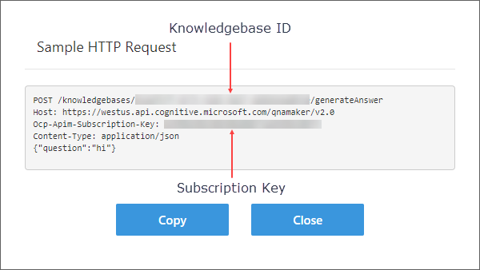

# Informational Bot Sample

The Informational Bot is a chatbot that can answer questions defined using Cognitive Services QnA Maker from multiple FAQs and could be extended to access data from Azure Search or other resources.

## Scenario

The Informational Bot is a chatbot that can answer questions from users using Cognitive Services QnA Maker. Using Cognitive Services QnA Maker, it's easy to define a base FAQ that a bot can use as a source. In addition, QnA Maker makes it easy to enhance the data source without redeploying your bot. That said, you might want a single bot to support more than one FAQ source. This bot shows you how you can that.

## Prerequisites

The minimum prerequisites to run this sample are:

- The latest update of Visual Studio 2017. You can download the community version [here](https://www.visualstudio.com/downloads/) for free.
- The Bot Framework Emulator. To install the Bot Framework Emulator, download it from [here](https://emulator.botframework.com/). Please refer to this [documentation article](https://github.com/microsoft/botframework-emulator/wiki/Getting-Started) to know more about the Bot Framework Emulator.
- Two configured QnA Maker FAQs configured at the [QnA Maker website](https://qnamaker.ai/).
- In order to test locally, you'll need the Azure workload installed with Visual Studio. The bot has been configured to use Azure Table Storage and works with the emulator when running locally. If you plan to deploy the bot, you'll need to provision an Azure Storage Account. You can find more details at [Manage custom state data with Azure Table Storage for .NET](https://docs.microsoft.com/en-us/azure/bot-service/dotnet/bot-builder-dotnet-state-azure-table-storage).

### Setup instructions

In order to work with this bot, you'll need to do the following:

- Configure two FAQs using QnA Maker

#### Configure QnA Maker

Creating FAQs is easy using QnA Maker. Go to the home page, [qnamaker.ai](https://qnamaker.ai/), and log in. After creating your  account, you'll be able to create a new services which effectively is an FAQ.

You'll need to create **two** FAQs with a few questions and answers in each FAQ. Feel free to import any existing FAQs you have or just make up something. The key is that you test your FAQs in the QnA Maker website and ensure you can ask a question and get an answer back. In designing a real FAQ, one approach is you have a root FAQ that has general questions and answers. Then you can an any number of child FAQs that provide more detailed information or are possibly even temporal in nature. For example, let's say your organization runs events. Thus you might have a generic event related FAQ that covers what the events are like, services, etc. A second FAQ could be event specific listing dates, locations, other locale specific information, etc.

Once you've created your FAQ, you need two pieces of data from each service: your *subscription key* and *knowledgebase ID*. The subscription key for your examples will be the same but for your real bots, they could be different. Each item is a GUID. You can find them by going to [qnamaker.ai/Home/MyServices]( https://qnamaker.ai/Home/MyServices). If you click the View Code link for one of your services the page will open a dialog the contains an sample HTTP request.



The first line, the POST, contains the knowledgebase ID. Line three contains the subscription key. Make a copy of both and save to a text file. Repeat the process for your second FAQ.

#### Update your App

Now you'll update your app with the information saved from the QnA Maker portal.

1. Open the **RootDialog.cs**.

1. At the top of the RootDialog class, you'll find a **QnAMaker** attribute.

1. Replace the placeholder parameters with your values:

    ````C#
    [QnAMaker("subscriptionKey", "knowledgebaseId", "Still looking ...", 0.01, 2)]
    ````
1. Open the **ChildDialog1.cs**.

1. At the top of the ChildDialog1 class, you'll find a **QnAMaker** attribute.

1. Replace the placeholder parameters with your values. Feel free to change the message displayed when no answer can be found by your bot.

    ````C#
    [QnAMaker("subscriptionKey", "knowledgebaseId", "I don't understand this right now! Try another query!", 0.01, 1)]
    ````
1. Save and build your bot.

## Code Highlights

The Informational Bot uses the QnAMakerDialog base class to handle communications with the QnAMaker service. Overriding **RespondFromQnAMakerResultAsync** provides the code with an opportunity to customize the response when an answer is found.

    ````C#
    protected override async Task RespondFromQnAMakerResultAsync(IDialogContext context, IMessageActivity message, QnAMakerResults results)
    {
        if (results.Answers.Count > 0)
        {
            var response = "Here is a match from our FAQ:  \r\n  Q: " +
                results.Answers.First().Answer;
            await context.PostAsync(response);
        }
    }
    ````

While you could also handle a lack of answers as well, the code uses a different approach. By overriding the **DefaultWaitNextMessageAsync** method and checking for zero answers, the bot can examine another FAQ, invoke a search using an external service like Azure Search, etc. In the sample, the bot instantiates a secondary dialog, in the example *ChildDialog1*, which is just another dialog that inherits from QnAMakerDialog and is bound to its own QnAMaker service. Using *context.Forward*, the child instance is given a chance to provide an answer to the users query.

    ````C#
    protected override async Task DefaultWaitNextMessageAsync(IDialogContext context, IMessageActivity message, QnAMakerResults results)
    {
        if (results.Answers.Count == 0)
        {
            var childFaq = new ChildDialog1();
            await context.Forward(childFaq, AfterFAQDialog, message, CancellationToken.None);
        }
        else
        {
            await base.DefaultWaitNextMessageAsync(context, message, results);
        }
    }
    ````
Using more advanced features of C#, you could fire off multiple searches at the same time if you needed.

### Using Application Insights

The Microsoft Bot Framework and runtime service provides support for gathering runtime telemetry and trends related to the use of your bot via Azure Application Insights.
You configure an Application Insights resource to gather and store data about your application. You can then access your My Bots page to review the information in the Analytics section. To add telemetry to your bot, you will need an Azure subscription and an Application Insights resource created for your bot.

In addition to the base support mentioned above, you can add full Application Insights support to your bot whether it’s been written in C# or Node.js. Doing this allows you to add custom telemetry data via Trace as well as write custom events. Application Insights will also gather additional data related to performance and exceptions that you can drill into from the Azure Portal as well as within Visual Studio if you’re using that to write your Bot.

If you want to use Application Insights in either capacity, you’ll first need to enable Application Insights support by following the instructions at [https://docs.microsoft.com/en-us/bot-framework/resources-app-insights-keys](https://docs.microsoft.com/en-us/bot-framework/resources-app-insights-keys).

Once you’ve done that, you can go to the next level by doing the following:

1. Open your solution in Visual Studio 2017.

1. In the Solution Explorer, right click on the **InformationalBot** project node, and select *Configure Application Insights*.

1. In the document well, click the **Start Free**.

1. Login in to Azure if necessary, pick your subscription and choose your Application Insights resource.

1. Follow the wizard enabling Trace options.

1. Build your bot.

1. Update NuGet to pick up the latest Application Insights binaries.

1. Deploy your updated bot.

1. You can then access your Application Insights resource via the Azure Portal.

## More Information

To get more information about how to get started in Bot Builder for .NET and QnA Maker please review the following resources:

- [Bot Builder for .NET](https://docs.botframework.com/en-us/csharp/builder/sdkreference/index.html)
- [QnA Maker](https://qnamaker.ai/)