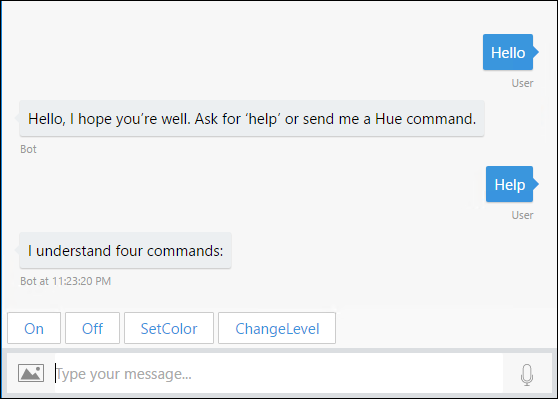
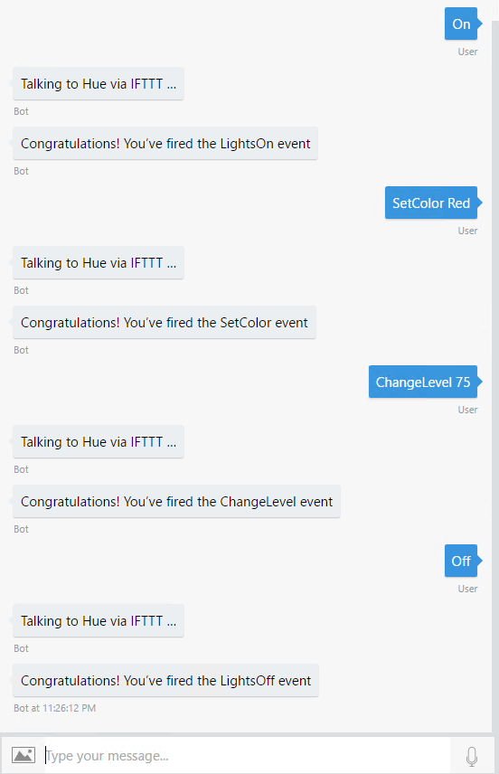

# Internet of Things (IoT) Bot Sample
This Internet of Things (IoT) Bot makes it easy for you to control devices around your home, such as a Philips Hue light using simple chat commands.

## Scenario
Using this simple bot, you can control your Philips Hue lights in conjunction with the free If This Than That (IFTTT) service. As an IoT device, the Philips Hue can be controlled locally via their exposed API. However, this API is not exposed for general access from outside the local network. However, IFTTT is a ["Friend of Hue"](http://www2.meethue.com/en-us/friends-of-hue/ifttt/) and thus has exposeed a number of control commands that you can issue such as turnning lights on and off, changing the color, or the light intensity.

## Prerequisites
The minimum prerequisites to run this sample are:
-   The latest update of Visual Studio 2017. You can download the community version [here](https://www.visualstudio.com/downloads/) for free.
-   The Bot Framework Emulator. To install the Bot Framework Emulator, download it from [here](https://emulator.botframework.com/). Please refer to this [documentation article](https://github.com/microsoft/botframework-emulator/wiki/Getting-Started) to know more about the Bot Framework Emulator.
-   A free [If This Than That (IFTTT)](https://ifttt.com/discover) account configured with four Applets that use Webhooks with the Philips Hue for On, Off, Change color, and Dim lights events.
-   A compatible Philips Hue light device (for example the Philips Hue starter kit with a bridge) with an account at [Philips](https://account.meethue.com/).

### Setup instructions
In order to work with this bot, you'll need to do the following:
-   Create the four Applets on IFTTT matching the naming convention used in the sample
-   Add you account key from IFTTT to the sample's source code
-   Run the bot using the Bot Framework Emulator

#### Create your Applets
1.  Log into your IFTTT account.

1.  Access the **Services** option from your Account menu.

1.  In the list of Services search for **Hue** and click on the displayed item.

1.  Click the **Connect** button to grant IFTTT access your Philips Hue account and lights.

Once you've connected your Hue to IFTTT, you'll create four Applets. Each Applet is started via a named Webhook.

You will need to create four Applets:
-   **LightsOn**--uses the *Turn on lights* action

-   **LightsOff**--uses the *Turn off lights* action

-   **SetColor**--uses the *Change color* action

-   **ChangeLevel**--uses the *Dim lights* action

To create an Applet, do the following:
1.  Click the **New Applet** button.

1.  Choose the **+this** item.

1.  In the list search for **Webhooks** and select it.

1.  Click the item.

1.  Type the **Event Name** like *LightsOn* and click **Create tigger**.

1.  Click **+that**.

1.  In the list search for **Hue** and select it.

1.  In the list of actions, choose the appropriate action (see list above).

1.  Assuming you've granted IFTTT access to your Hue, you'll be able to choose the lights affected by the action. Choose your lights and click **Create action**.

1.  Review the recipe, and click Finish to enable the applet.

Now repeat the process so that you have all four applets defined.

Finally, you'll need to get your personal access code to call your Applets from your bot.

1.  From the list of Applets, select any one of them.

1.  Click the Webhook logo.

1.  On the Webhooks page, click **Settings**.

1.  On the screen, you'll see a URL with a long *key* at the end after the last backslash. Copy that somewhere for safe keeping.

#### Configure the bot
Assuming you've cloned the repo, do the following:

1.  Open the Visual Studio Solution **IotBot.sln**.

1.  Select **Build | Rebuild Solution** to restore the NuGet packages and compile the bot.

1.  Open the **RootDialog.cs** file.

1.  You'll find a const **key** that needs a value. Insert your IFTTT Webhooks key you copied earlier.

1.  Save your changes and build the solution.

That's it, you can now try out your bot using the emulator. Please refer to this [documentation article](https://github.com/microsoft/botframework-emulator/wiki/Getting-Started) to know more about the Bot Framework Emulator.

##Code Highlights
The bot has three procedures that do the main work: MessageReceivedAsync, CallHue, and ShowHelp.

### MessageReceivedAsync
This procedure is responsible for validating the command input from the users. This is a simple implimentation and could be enhanced to use LUIS for richer language interaction.

````C#
private async Task MessageReceivedAsync(IDialogContext context, IAwaitable<object> result)
{
    var activity = await result as Activity;

    string userText = activity.Text.ToLower();
    string userCmd = activity.Text.ToLower();
    string userSubCmd = string.Empty;

    string command = "LightsOff";
    bool sendCmd = true;

    if (userText.Contains(" "))
    {
        string[] userWords = userText.Split(' ');
        userCmd = userWords[0];
        userSubCmd = userWords[1];
    }

    switch (userCmd)
    {
        case cmdOn:
            command = "LightsOn";
            break;
        case cmdOff:
            command = "LightsOff";
            break;
        case cmdSetColor:
            command = "SetColor";
            break;
        case cmdChangeLevel:
            command = "ChangeLevel";
            break;
        default:
            sendCmd = false;
            break;
    }

    if (sendCmd)
    {
        // call Hue via IFTTT
        await CallHue(context, activity, command, userSubCmd);
    }
    else
    {
        // check for local commands
        switch (userCmd)
        {
            case cmdHelp:
                await ShowHelp(context, activity);
                break;
            case cmdHello:
                await context.PostAsync("Hello, I hope you're well. Ask for 'help' or send me a Hue command.");
                break;
            default:
                await context.PostAsync(activity.Text + " is not a command I know!");
                break;
        }
    }

    context.Wait(MessageReceivedAsync);
}
````

### CallHue
Assuming the text sent by the user to the bot is one of the recognized commands, MessageReceivedAsync calls the the CallHue procedure. The code builds the correct command URL for IFTTT and then uses HTTPClient to perform an HTTP Post, checking for success.

````C#
private async Task CallHue(IDialogContext context, Activity activity, string command, string subcommand)
{
    string cmdUrl = MakeHueUrl(command);

    await context.PostAsync("Talking to Hue via IFTTT ...");

    using (var client = new HttpClient())
    {
        using (var request = new HttpRequestMessage(HttpMethod.Post, cmdUrl))
        {
            request.Headers.Accept.Add(new MediaTypeWithQualityHeaderValue("application/json"));
            if (!string.IsNullOrEmpty(subcommand))
            {
                JObject body = new JObject();
                body.Add(new JProperty("value1", subcommand));

                var httpContent = new StringContent(body.ToString(), Encoding.UTF8, "application/json");
                request.Content = httpContent;
            }

            using (var response = await client.SendAsync(request))
            {
                if (response.IsSuccessStatusCode)
                {
                    Trace.TraceInformation(activity.Text + " was a success!");
                    string responseText = await response.Content.ReadAsStringAsync();
                    await context.PostAsync(responseText);
                }
            }
        }
    }
}

````

### ShowHelp
The ShowHelp method presents a list of understood commands via suggested actions. Suggested actions enable the bot to present buttons that the you can tap to provide input. So not only does it provide the commands you can use, but just clicking the button will execute the command. In the case of SetColor and ChangeLevel, default values are provided.

````C#
private async Task ShowHelp(IDialogContext context, Activity activity)
{
    Activity reply = activity.CreateReply("I understand four commands:");
    reply.Type = ActivityTypes.Message;
    reply.TextFormat = TextFormatTypes.Plain;

    reply.SuggestedActions = new SuggestedActions()
    {
        Actions = new List<CardAction>()
                        {
                            new CardAction(){ Title = "On", Type=ActionTypes.ImBack, Value="On" },
                            new CardAction(){ Title = "Off", Type=ActionTypes.ImBack, Value="Off" },
                            new CardAction(){ Title = "SetColor", Type=ActionTypes.ImBack, Value="SetColor Red" },
                            new CardAction(){ Title = "ChangeLevel", Type=ActionTypes.ImBack, Value="ChangeLevel 75" }
                        }
    };
    await context.PostAsync(reply);
}
````

## Outcome
You will see the following when connecting the Bot to the Emulator and sending the various commands:





## More Information
To get more information about how to get started in Bot Builder for .NET and Conversations please review the following resources:
-   [Bot Builder for .NET](https://docs.botframework.com/en-us/csharp/builder/sdkreference/index.html)
-   [Add suggested actions to messages](https://docs.microsoft.com/en-us/bot-framework/dotnet/bot-builder-dotnet-add-suggested-actions)